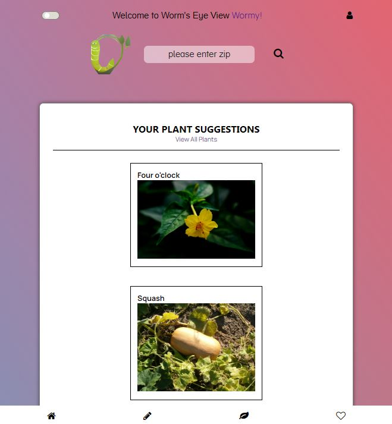
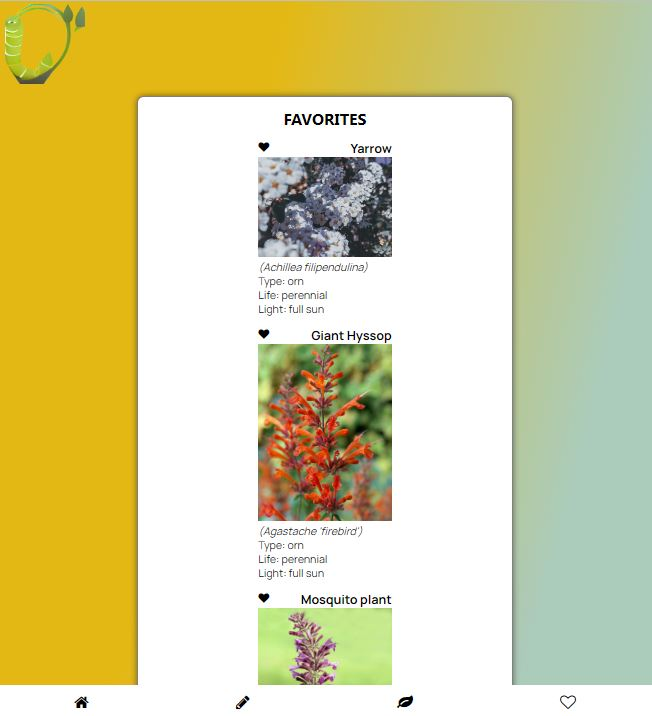
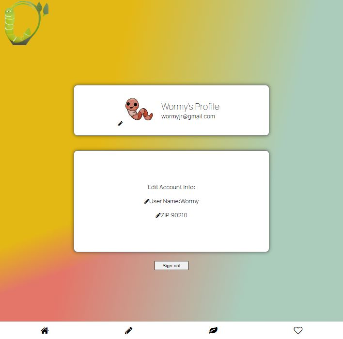

# Worm's Eye View - Gardening Companion

This is a gardening companion app to assist gardeners. Based on a user's location, the app will suggest suitable plants to grow for their location and time of year. Additionally, the user can browse the entire database of 500 plants, save favorite plants, journal the progress of their plants and plan their garden with a garden plot visualizer tool.

Team members:
An Emard, Grace Gao, Kenny Johnson, Kevin Lam

## Quick Start Guide

1. Clone the repo to your local machine
2. In the terminal in the project directory run `npm install`
3. Then run `npm run start`
4. Your browser should open a new view and the app will be running

## Main Features

- Plant suggestion algorithm based on user location and current date
- Journaling tool to record plant growth, and search function to find prior journal entries
- The user is able to view all plants in the database, filter through all plants
- Select an individual plant to get detail information
- Able to favorite a plant to save browsed plants
- Interactive garden plot visualization tool to plan a garden
- Saved user information for repeat usage
- Edit and update user profile information

## Rendered Pages

Home view & Plant suggestions

Journaling Tool

View and filter all plants

Favorites Selection

Garden Plot Visualization

## Project Details

### Main Technology Stack

- Backend, Database & User Authentication: Firebase
- Frontend: React, p5js
- Language: Javascript
- APIs: weatherapi, pexels images, phzmapi.org [https://github.com/waldoj/frostline]

### Additional technologies

- React Theme Context
- Font Awesome, Tailwind
- React-router
